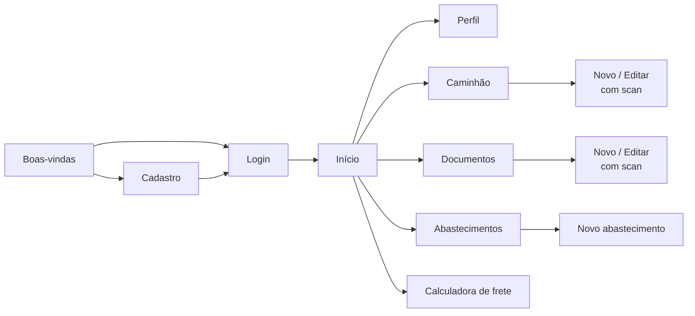

# 📱 RodaBem — Front-End

Aplicativo mobile do RodaBem, feito com Expo e React Native. É por ele que o caminhoneiro cadastra o caminhão e os documentos, registra abastecimentos e simula fretes.


---

## Sumário

1. [Telas](#1-telas)
2. [Navegação](#2-navegação)
3. [Gerenciamento de dados e sessão](#3-gerenciamento-de-dados-e-sessão)
4. [Tecnologias](#4-tecnologias)
5. [Como rodar](#5-como-rodar)
6. [Variáveis de ambiente](#6-variáveis-de-ambiente)
7. [Testes](#7-testes)
8. [Estrutura de pastas](#8-estrutura-de-pastas)

---

## 1. Telas

| Tela | O que o usuário faz |
|---|---|
| **Boas-vindas** | Escolhe entre entrar ou criar conta. |
| **Cadastro** | Informa nome, e-mail, CPF, telefone e senha (com máscara de CPF e telefone). |
| **Login** | Entra com CPF ou telefone + senha. |
| **Início** | Acessa as quatro áreas principais por atalhos e pelo menu lateral. |
| **Perfil** | Vê e edita seus dados e troca a senha. |
| **Meu caminhão** | Cadastra o veículo **tirando uma foto ou enviando o PDF do CRLV**; os campos são preenchidos automaticamente e podem ser corrigidos antes de salvar. |
| **Meus documentos** | Cadastra CNH, CRLV, ANTT e outros, anexa o arquivo e vê cada um marcado como **válido**, **vencendo** (até 30 dias) ou **vencido**. |
| **Abastecimentos** | Registra abastecimentos e acompanha o consumo médio do caminhão (km/L). |
| **Calculadora de frete** | Informa origem, destino, tipo de carga, preço do diesel e pedágios, e vê distância, custo, piso ANTT e **valor líquido** — com aviso quando o frete não compensa. |

> 📸 *Sugestão: adicione capturas de tela das principais telas (ex.: `docs/screenshots/home.png`).*

## 2. Navegação

A navegação usa o **Expo Router**: cada arquivo dentro de `app/` vira uma rota automaticamente.



## 3. Gerenciamento de dados e sessão

- **Axios** (`src/services/api.ts`): instância única que adiciona o token em todas as requisições.
- **Services** (`src/services/`): um arquivo por área — `authService`, `userService`, `caminhaoService`, `documentoService`, `abastecimentoService`, `freteService`, `scanService`.
- **Tipos** (`src/@types/`): tipagem das respostas usadas em cada tela.
- **TanStack Query**: cache, estados de carregamento/erro e atualização das listas após criar, editar ou excluir.
- **Sessão** (`src/contexts/authContext.tsx`): guarda o usuário logado e expõe login, cadastro e logout para todo o app.
- **Expo SecureStore**: o token e os dados do usuário ficam no armazenamento criptografado do aparelho.
- **Toast** (`src/shared/ui/molecules/Toast`): mensagens de sucesso e erro exibidas ao usuário.

## 4. Tecnologias

| Tecnologia | Uso |
|---|---|
| **Expo 54 + React Native 0.81** | Base do aplicativo (Android, iOS e web). |
| **Expo Router** | Navegação por arquivos e menu lateral (*drawer*). |
| **TanStack Query** | Requisições, cache e sincronização de dados. |
| **Axios** | Cliente HTTP. |
| **Expo SecureStore** | Armazenamento seguro do token. |
| **Expo Image Picker / Document Picker** | Câmera, galeria e seleção de PDF para o scan. |
| **NativeWind (Tailwind CSS)** | Estilização. |
| **Jest + Testing Library** | Testes de telas, contextos, hooks e serviços. |

## 5. Como rodar

### Pré-requisitos

- **Node.js 18+** e **npm**
- A API do projeto em execução
- Para celular físico: app **[Expo Go](https://expo.dev/go)**, com o celular **na mesma rede Wi-Fi** do computador
- Para emulador: Android Studio ou Xcode (macOS)

### Passo a passo

```bash
# 1. Entre na pasta
cd Front-End

# 2. Instale as dependências
npm install

# 3. Crie o arquivo .env (ver seção 6)

# 4. Inicie o Expo na rede local
npx expo start --lan
```

No terminal do Expo:

- **Celular físico:** escaneie o QR Code com o Expo Go (Android) ou com a câmera (iOS).
- **Emulador Android:** pressione `a`.
- **Simulador iOS:** pressione `i`.

> ⚠️ Depois de alterar o `.env`, reinicie com `npx expo start --lan -c` para limpar o cache.

## 6. Variáveis de ambiente

Crie o arquivo `.env` dentro de `Front-End/`:

```env
EXPO_PUBLIC_API_BASE_URL=http://192.168.0.10:3000
EXPO_PUBLIC_TOKEN_KEY=rodabem_token
EXPO_PUBLIC_USER_KEY=rodabem_user
```

| Variável | Descrição |
|---|---|
| `EXPO_PUBLIC_API_BASE_URL` | Endereço da API (veja a tabela abaixo). |
| `EXPO_PUBLIC_TOKEN_KEY` | Chave usada para salvar o token no SecureStore. |
| `EXPO_PUBLIC_USER_KEY` | Chave usada para salvar os dados do usuário. |

**Qual endereço usar:**

| Onde o app está rodando | `EXPO_PUBLIC_API_BASE_URL` |
|---|---|
| Celular físico (Expo Go) | IP local do computador, ex.: `http://192.168.0.10:3000` |
| Emulador Android | `http://10.0.2.2:3000` |
| Simulador iOS ou navegador | `http://localhost:3000` |

> Para descobrir o IP local: `ipconfig` (Windows) ou `ip addr` / `ifconfig` (Linux/macOS).

## 7. Testes

```bash
npm test             # executa todos os testes
npm run test:cov     # testes com relatório de cobertura
npm run test:report  # relatório resumido das suítes
```

Os testes cobrem os *services*, o contexto de autenticação, o hook de usuário e fluxos completos de tela: login, cadastro, perfil e scan de caminhão e documento.

## 8. Estrutura de pastas

```text
Front-End/
├── app/                      # telas (cada arquivo é uma rota)
│   ├── _layout.tsx           # providers globais (sessão, query, toast, tema)
│   ├── index.tsx             # tela de boas-vindas
│   ├── login.tsx · register.tsx · forgotPassword.tsx
│   ├── (drawer)/home.tsx     # tela inicial com menu lateral
│   ├── perfil.tsx
│   ├── caminhoes/            # listar, cadastrar (com scan) e editar
│   ├── documentos/           # listar, cadastrar (com scan) e editar
│   ├── abastecimentos/       # listar e registrar
│   ├── frete.tsx             # calculadora de frete
│   └── __tests__/            # testes de telas e fluxos
├── src/
│   ├── services/             # comunicação HTTP (um arquivo por área)
│   ├── @types/               # tipos TypeScript
│   ├── contexts/             # sessão do usuário e tamanho de fonte
│   ├── hooks/                # hooks reutilizáveis
│   ├── components/           # componentes das telas (cards, inputs, header…)
│   ├── shared/ui/            # componentes base (botão, avatar, toast)
│   ├── constants/            # cores do tema
│   └── utils/                # máscaras de CPF/telefone e queryClient
├── assets/                   # ícones, logo e fontes
└── test/setup.ts             # configuração do Jest
```
