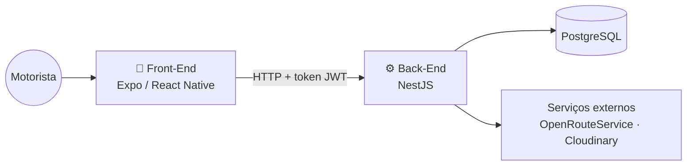

# 🚚 RodaBem

Sistema de apoio ao **caminhoneiro autônomo**, desenvolvido como Trabalho de Conclusão de Curso. Ele reúne em um aplicativo de celular o controle do caminhão, dos documentos, dos abastecimentos e uma **calculadora de frete** baseada no piso mínimo da ANTT.

---

## O problema

O caminhoneiro autônomo costuma controlar documentos, gastos e valores de frete em papel, planilhas ou de cabeça. Isso gera dois problemas recorrentes:

- **Documentos vencidos** (CRLV, CNH, ANTT etc.), que resultam em multa e veículo retido.
- **Fretes aceitos abaixo do custo**, porque o motorista não sabe quanto vai gastar na viagem nem qual é o valor mínimo garantido por lei.

## A solução

O RodaBem registra os dados do motorista e do veículo e usa esse histórico para **avisar antes que um documento vença** e **calcular se um frete compensa** antes de ser aceito.

| Funcionalidade | Descrição |
|---|---|
| 🔐 **Conta do motorista** | Cadastro e login com CPF ou telefone + senha. |
| 🚛 **Meu caminhão** | Cadastro do veículo com **leitura automática do CRLV** por foto ou PDF. |
| 📄 **Meus documentos** | Controle de CNH, CRLV, ANTT e outros, com aviso de vencimento. |
| ⛽ **Abastecimentos** | Registro de cada abastecimento e cálculo do **consumo médio (km/L)**. |
| 🧮 **Calculadora de frete** | Distância real, custo de combustível e pedágios comparados ao **piso mínimo da ANTT**, com aviso quando o frete não cobre os custos. |

## Organização do repositório

O projeto é dividido em duas aplicações independentes, cada uma com seu próprio README, dependências e testes:

```text
rodabem-api/
├── Back-End/    → API REST (NestJS + Prisma + PostgreSQL)
└── Front-End/   → Aplicativo mobile (Expo + React Native)
```

| Pasta | O que contém | Documentação |
|---|---|---|
| **Back-End** | Regras de negócio, banco de dados, autenticação, OCR de documentos e cálculo de frete. | [Back-End/README.md](./Back-End/README.md) |
| **Front-End** | Telas do aplicativo usado pelo motorista. | [Front-End/README.md](./Front-End/README.md) |

## Como as partes se conectam



O aplicativo não acessa o banco diretamente: toda informação passa pela API, que valida o usuário pelo token e aplica as regras de negócio.

## Tecnologias

| Camada | Principais tecnologias |
|---|---|
| **Back-End** | NestJS, TypeScript, Prisma, PostgreSQL, JWT, Tesseract.js (OCR), Jest |
| **Front-End** | Expo, React Native, TypeScript, Expo Router, TanStack Query, Axios, NativeWind, Jest |
| **Infraestrutura** | Docker (banco de dados), OpenRouteService (rotas), Cloudinary (arquivos) |

## Executando o projeto completo

A API precisa estar rodando antes do aplicativo.

1. **Back-End:** siga o passo a passo em [Back-End/README.md](./Back-End/README.md) — banco, variáveis de ambiente, migrations e seed da ANTT.
2. **Front-End:** siga o passo a passo em [Front-End/README.md](./Front-End/README.md) — configure o endereço da API e abra o app no celular ou emulador.

Resumo:

```bash
git clone https://github.com/Pport0/rodabem-api.git
cd rodabem-api

# Terminal 1 — API
cd Back-End
npm install
docker compose up -d
npx prisma migrate dev
npx prisma db seed
npm run start:dev

# Terminal 2 — App
cd Front-End
npm install
npx expo start --lan
```

> Cada pasta precisa do seu próprio arquivo `.env`. Os valores estão descritos nos READMEs de cada uma.

---

Projeto desenvolvido como Trabalho de Conclusão de Curso.
